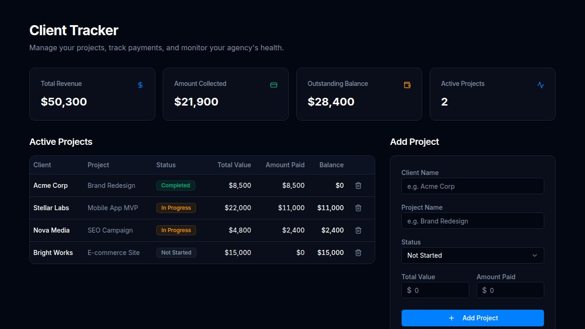

# Client Ledger Dashboard (Community Edition)



[](LICENSE)
[](https://react.dev/)
[](https://www.typescriptlang.org/)
[](https://supabase.com)

A modern, open-source client management and financial ledger dashboard built for freelancers, agencies, and micro-consultancies. Track client accounts, project milestones, payments, server infrastructure, internal tools, and invoices — all in one self-hostable platform.

**Community Edition vs Pro**: This Community Edition includes the core features required to manage clients and projects independently. Custom extensions (like automated Stripe billing or multi-currency handling) are part of agency-specific private setups.

---

## ✨ Features

- **🔐 Role-Based Auth**: Admin & Client roles with signup approval workflow powered by Supabase Auth.
- **📊 Admin Dashboard**: High-level scorecards for total revenue, collected payments, outstanding balances, and active client projects.
- **📁 Project Tracking**: Manage projects with status badges, balance auto-calculation, and client filtering.
- **🖥️ VPS Infrastructure Tracker**: Catalog VPS servers, IP addresses, access credentials, and deployed applications.
- **🔧 Internal Tools Directory**: Share links and descriptions to internal micro-apps and client portals.
- **🧾 Invoicing**: Generate, track, and manage client invoice records.
- **🎨 Modern Dark Mode UI**: Built with React 19, Tailwind CSS v4, Radix UI primitives, and Framer Motion.

---

## 🚀 Quickstart Guide

### Prerequisites
- [Node.js 18+](https://nodejs.org) (if running locally) or Docker
- A free [Supabase](https://supabase.com) account

---

### Step 1: Clone the Repository
```bash
git clone https://github.com/Mudassirdbs/Client-Ledger.git
cd Client-Ledger
```

---

### Step 2: Configure Environment Variables
Copy the example environment file:
```bash
cp .env.example .env.local
```
Open `.env.local` and enter your Supabase Project URL and Anon API key:
```env
VITE_SUPABASE_URL=https://your-project-id.supabase.co
VITE_SUPABASE_ANON_KEY=your-anon-key-here
VITE_ENABLE_DEMO_MODE=false
```
> **Tip:** Set `VITE_ENABLE_DEMO_MODE=true` to instantly test the UI offline using a mock admin session without connecting to Supabase.

---

### Step 3: Setup Database Schema & Sample Data
1. Open your project in the [Supabase Dashboard](https://supabase.com/dashboard).
2. Go to the **SQL Editor**.
3. Paste the contents of [`supabase/schema.sql`](supabase/schema.sql) and click **Run**.
4. *(Optional)* Paste the contents of [`supabase/seed.sql`](supabase/seed.sql) and click **Run** to populate sample projects, servers, tools, and invoices.

---

### Step 4: Run the Application

#### Option A: Node.js (Development)
```bash
npm install
npm run dev
```
Open [http://localhost:5173](http://localhost:5173) in your browser.

#### Option B: Docker (Production)
```bash
docker compose up -d --build
```
Open [http://localhost:8080](http://localhost:8080) in your browser.

---

## 🛡️ Authentication & Role Security

This project relies on Supabase Auth and PostgreSQL Row Level Security (RLS) to enforce data privacy. 
By default, the profile creation trigger (defined in `schema.sql`) operates as follows:
- **First Registered User**: Automatically assigned the `admin` role and `approved` status.
- **Subsequent Users**: Automatically assigned the `client` role and `pending` status.
- **Admin Approval Flow**: Admins can approve pending client accounts from the `/admin/approvals` dashboard. Pending users cannot view projects until approved.
- **Email Confirmation**: If you want to require email confirmation before users can log in, enable this in your Supabase Auth settings.

---

## 🛠️ Tech Stack

| Component | Technology |
| :--- | :--- |
| **Frontend Framework** | React 19 + TypeScript |
| **Bundler** | Vite 7 |
| **Styling** | Tailwind CSS v4 + Radix UI |
| **Backend / DB** | Supabase (Auth, PostgreSQL, Realtime) |
| **Routing** | Wouter |
| **Charts** | Recharts |

---

## 🌐 Deployment (Vercel / Netlify)

### Deploy to Vercel
1. Push your repository to GitHub.
2. Import the repo in [Vercel](https://vercel.com).
3. Add `VITE_SUPABASE_URL` and `VITE_SUPABASE_ANON_KEY` to Vercel Environment Variables.
4. Click **Deploy**.

---

## 🗺️ Roadmap & Good First Issues

Interested in contributing? Here are some features we'd love to see:
- [ ] Stripe Webhooks integration for automatic invoice status updates
- [ ] Multi-currency support for projects
- [ ] Downloadable PDF invoice generation directly from the browser
- [ ] Email notifications for pending invoice reminders

---

## 🤝 Contributing

Contributions are welcome! Please read [`CONTRIBUTING.md`](CONTRIBUTING.md) to get started.

**Recommended GitHub Topics**: `react`, `supabase`, `typescript`, `saas`, `dashboard`, `open-source`, `vite`, `tailwindcss`.

---

## 📄 License

This project is open-source software licensed under the [MIT License](LICENSE).
